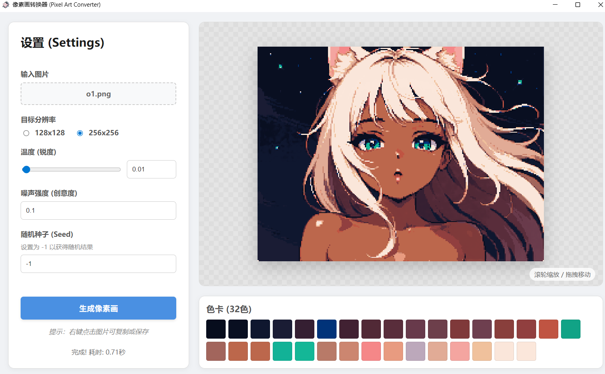

# 🎨 AI Pixel Art Converter (Pixelformer)

<div align="center">


**A local desktop app transforming images into high-quality Pixel Art using Deep Learning.**  
**一个基于深度学习的本地桌面应用，将图片转换为高质量的像素画。**

[Features (特性)](#-features-功能特性) • [Installation (安装)](#-installation--usage-安装与使用) • [Tech Stack (技术栈)](#-technical-architecture-技术架构) • [Gallery (画廊)](#-gallery-效果展示)

</div>

---

## 📖 Introduction (简介)

**English**  
This is not a simple downsampling filter. **Pixelformer** is an AI-powered tool that understands image structure and lighting. It uses a custom **Transformer + CNN** architecture trained with GANs to generate crisp, aesthetically pleasing pixel art with coherent color palettes. The application runs locally using **ONNX Runtime** and **PyWebView**, requiring no expensive GPU for inference.

**中文**  
这不是一个简单的马赛克滤镜。**Pixelformer** 是一个由 AI 驱动的工具，它能理解图像的结构和光影。项目使用了自定义的 **Transformer + CNN** 混合架构，并通过 GAN（生成对抗网络）进行训练，能够生成清晰、具有美感的像素画以及连贯的色板。应用程序基于 **ONNX Runtime** 和 **PyWebView** 构建，完全本地运行，无需昂贵的显卡即可快速推理。

---

## ✨ Features (功能特性)

| Feature | Description (English) | 说明 (中文) |
| :--- | :--- | :--- |
| **🧠 AI Core** | Powered by **Paletteformer**, trained with Perceptual & GAN losses. | 内置 **Paletteformer** 模型，基于感知损失和 GAN 训练。 |
| **⚡ Local Inference** | Runs on CPU via ONNX. No internet needed. | 基于 ONNX 的 CPU 推理，无需联网，速度快。 |
| **🎨 Smart Palette** | Extracts a coherent 32-color palette automatically. | 自动提取并生成协调的 32 色色卡。 |
| **🎛️ Creative Control** | Adjust **Temperature** (sharpness) and **Noise** (texture). | 可调节**温度**（控制锐度）和**噪声**（增加纹理细节）。 |
| **🖥️ Desktop UI** | Lightweight GUI with Drag & Drop, Zoom, and Pan support. | 轻量级 GUI，支持拖拽上传、滚轮缩放和平移预览。 |
| **📐 Multi-Res** | Supports 128x128 and 256x256 output resolutions. | 支持 128x128 和 256x256 两种输出分辨率。 |

---

## 🖼️ Gallery (效果展示)

<div align="center">
  
</div>

| Input (原图) | Pixel Art (像素画 128 ) | Pixel Art (像素画 256 )  |
| :---: | :---: | :---: |
|  |  | |
|  |  | |
---

## 🛠 Technical Architecture (技术架构)

### Model: Paletteformer
The core model combines the best of CNNs and Transformers:
1.  **Content Encoder**: A ResNet-style encoder extracts multi-scale features.
2.  **Contextual Palette Extractor**: Uses **Self-Attention** to generate adaptive color queries based on input noise and image features.
3.  **Pixel Decoder**: Reconstructs the image pixel-by-pixel using the learned palette.

### Training Strategy (训练策略)
We employ a 3-stage training pipeline to ensure quality:
*   **Stage 1 (Structure)**: L1 Loss for basic shape reconstruction.
*   **Stage 2 (Color)**: **Chamfer Distance Loss** in CIELAB space to enforce accurate color perception.
*   **Stage 3 (Refinement)**: **GAN (Hinge Loss)** + Hard Gumbel-Softmax to sharpen pixels and remove blur.

### 核心模型：Paletteformer
核心模型结合了 CNN 和 Transformer 的优势：
1.  **内容编码器**：使用类 ResNet 结构提取多尺度图像特征。
2.  **上下文色板提取器**：利用**自注意力机制**，根据输入噪声和图像特征生成自适应的颜色查询向量。
3.  **像素解码器**：利用学习到的色板逐像素重构图像。

### 训练策略
我们采用了三阶段训练流程以保证质量：
*   **阶段 1 (结构)**：使用 L1 损失函数学习基本形状重构。
*   **阶段 2 (色彩)**：在 CIELAB 空间使用**倒角距离损失 (Chamfer Distance Loss)**，确保色彩感知的准确性。
*   **阶段 3 (精细化)**：引入 **GAN (Hinge Loss)** 和 Hard Gumbel-Softmax，消除模糊，使像素点更加锐利清晰。

---

## 📦 Installation & Usage (安装与使用)

### Prerequisites (前置要求)
*   Python 3.8+
*   pip

### 1. Clone the repository (克隆仓库)
```bash
git clone https://github.com/yourusername/pixel-art-ai.git
cd pixel-art-ai
```

### 2. Install Dependencies (安装依赖)
```bash
pip install -r requirements.txt
```
*(Dependencies include: `pywebview`, `onnxruntime`, `numpy`, `Pillow`)*

### 3. Setup Models (准备模型)
Place your trained ONNX models in the `onnx_models` folder.
请将训练导出好的 ONNX 模型放入 `onnx_models` 文件夹。
```text
project_root/
├── onnx_models/
│   ├── pixelart_128.onnx
│   └── pixelart_256.onnx
```

### 4. Run the App (运行应用)
```bash
python app.py
```

---

## 📂 Project Structure (项目结构)

```text
.
├── app.py                # Main Application Entry (GUI Logic) / 主程序入口
├── index.html            # Frontend UI (HTML/CSS/JS) / 前端界面
├── onnx_models/          # Model Storage / 模型存放目录
└── requirements.txt      # Dependencies / 依赖列表
```

---

## 🤝 Contributing (贡献)

Contributions are welcome! If you have ideas for better loss functions or UI improvements, feel free to open an issue or PR.
欢迎贡献代码！如果你对损失函数改进或 UI 优化有任何想法，欢迎提交 Issue 或 PR。

1.  Fork the Project
2.  Create your Feature Branch (`git checkout -b feature/NewFeature`)
3.  Commit your Changes (`git commit -m 'Add some NewFeature'`)
4.  Push to the Branch (`git push origin feature/NewFeature`)
5.  Open a Pull Request

---

## 📄 License

Distributed under the MIT License. See `LICENSE` for more information.

---

<div align="center">
  <sub>Built with ❤️ by [Your Name]</sub>
</div>
